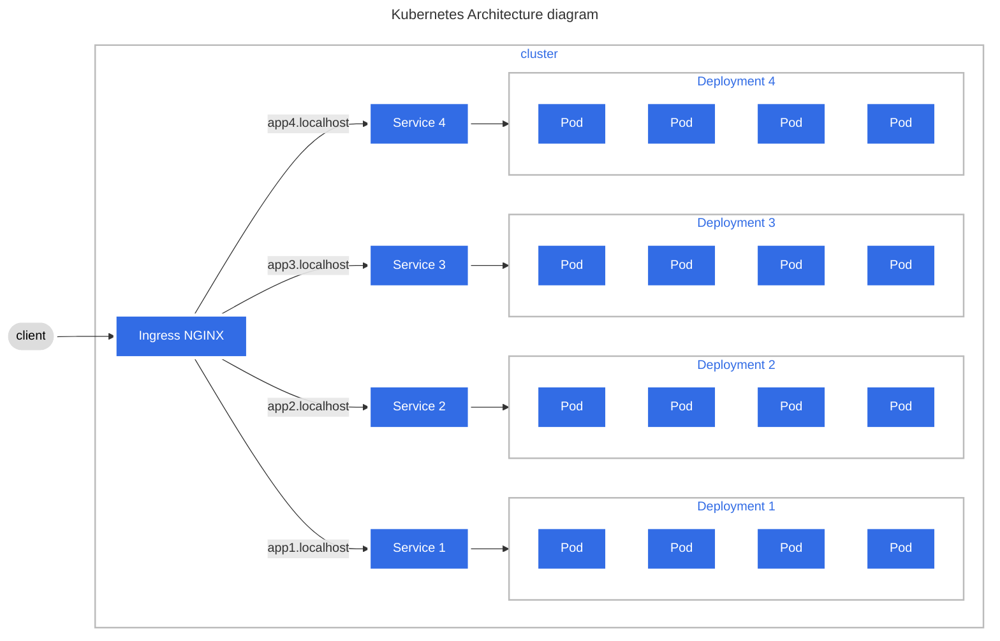

# Configuring Kuberenetes cluster

### Install Ingress-Nginx
```sh
kubectl apply -f https://raw.githubusercontent.com/kubernetes/ingress-nginx/controller-v1.5.1/deploy/static/provider/cloud/deploy.yaml
```

### Architecture diagram


