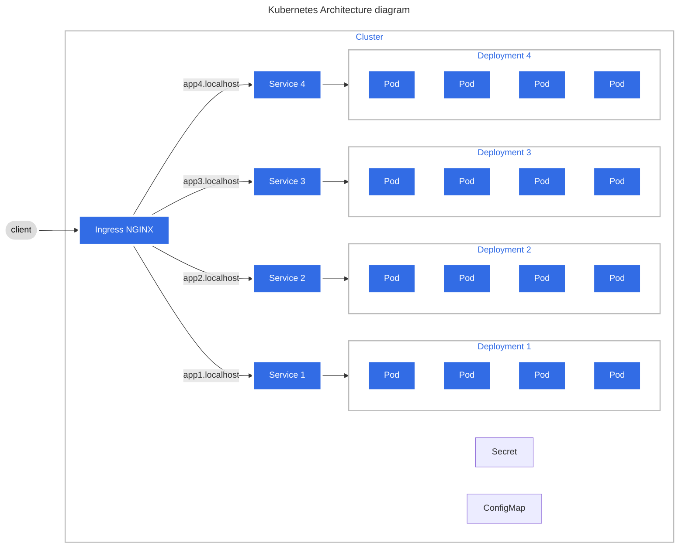

# Configuring Kubernetes cluster


## Table of content
- [Configuring Kubernetes cluster](#configuring-kubernetes-cluster)
  - [Table of content](#table-of-content)
  - [Architecture diagram](#architecture-diagram)
  - [Getting started](#getting-started)
    - [Connect kubectl to EKS cluster](#connect-kubectl-to-eks-cluster)
    - [Check connection](#check-connection)
    - [Install Ingress-Nginx](#install-ingress-nginx)
      - [Docker Desktop](#docker-desktop)
      - [AWS](#aws)
    - [Apply K8s declaration to the cluster](#apply-k8s-declaration-to-the-cluster)

## Architecture diagram



## Getting started

### Connect kubectl to EKS cluster

```sh
aws eks update-kubeconfig --region eu-west-2 --name DevOps-Course
```

### Check connection
```sh
kubectl get svc
```

### Install Ingress-Nginx

#### Docker Desktop
```sh
kubectl apply -f https://raw.githubusercontent.com/kubernetes/ingress-nginx/controller-v1.5.1/deploy/static/provider/cloud/deploy.yaml
```

#### AWS
```sh
kubectl apply -f https://raw.githubusercontent.com/kubernetes/ingress-nginx/controller-v1.5.1/deploy/static/provider/aws/deploy.yaml
```

### Apply K8s declaration to the cluster
```sh
kubectl apply -f .
```

Check the status, if all pods, deployments and services are in place

```sh
$ kubectl get all
NAME                                    READY   STATUS    RESTARTS   AGE
pod/nodejs-demoapp-1-85cd4d5886-86rf9   1/1     Running   0          24m
pod/nodejs-demoapp-1-85cd4d5886-rz4ck   1/1     Running   0          24m
pod/nodejs-demoapp-1-85cd4d5886-w5lbr   1/1     Running   0          24m
pod/nodejs-demoapp-1-85cd4d5886-xk5kn   1/1     Running   0          24m
pod/nodejs-demoapp-2-5db8fd49ff-fgzl5   1/1     Running   0          24m
pod/nodejs-demoapp-2-5db8fd49ff-m7x44   1/1     Running   0          24m
pod/nodejs-demoapp-2-5db8fd49ff-mwbzv   1/1     Running   0          24m
pod/nodejs-demoapp-2-5db8fd49ff-p6vrm   1/1     Running   0          24m
pod/nodejs-demoapp-3-6bff66bddd-2wxvz   1/1     Running   0          24m
pod/nodejs-demoapp-3-6bff66bddd-cfdfj   1/1     Running   0          24m
pod/nodejs-demoapp-3-6bff66bddd-gskrb   1/1     Running   0          24m
pod/nodejs-demoapp-3-6bff66bddd-vbxzp   1/1     Running   0          24m
pod/nodejs-demoapp-4-7b66c56969-47njg   1/1     Running   0          24m
pod/nodejs-demoapp-4-7b66c56969-kqz9k   1/1     Running   0          24m
pod/nodejs-demoapp-4-7b66c56969-pf4rw   1/1     Running   0          24m
pod/nodejs-demoapp-4-7b66c56969-qjdcc   1/1     Running   0          24m

NAME                       TYPE        CLUSTER-IP       EXTERNAL-IP   PORT(S)   AGE
service/kubernetes         ClusterIP   172.20.0.1       <none>        443/TCP   47m
service/nodejs-demoapp-1   ClusterIP   172.20.11.87     <none>        80/TCP    24m
service/nodejs-demoapp-2   ClusterIP   172.20.234.193   <none>        80/TCP    24m
service/nodejs-demoapp-3   ClusterIP   172.20.191.146   <none>        80/TCP    24m
service/nodejs-demoapp-4   ClusterIP   172.20.226.98    <none>        80/TCP    24m

NAME                               READY   UP-TO-DATE   AVAILABLE   AGE
deployment.apps/nodejs-demoapp-1   4/4     4            4           24m
deployment.apps/nodejs-demoapp-2   4/4     4            4           24m
deployment.apps/nodejs-demoapp-3   4/4     4            4           24m
deployment.apps/nodejs-demoapp-4   4/4     4            4           24m

NAME                                          DESIRED   CURRENT   READY   AGE
replicaset.apps/nodejs-demoapp-1-85cd4d5886   4         4         4       24m
replicaset.apps/nodejs-demoapp-2-5db8fd49ff   4         4         4       24m
replicaset.apps/nodejs-demoapp-3-6bff66bddd   4         4         4       24m
replicaset.apps/nodejs-demoapp-4-7b66c56969   4         4         4       24m
```

Check the address assigned to our ingress controller

```sh
kubectl get ingress

NAME                     CLASS   HOSTS                                             ADDRESS                                                                         PORTS   AGE
nodejs-demoapp-ingress   nginx   app1.eugene,app2.eugene,app3.eugene + 1 more...   aeba934c0e574469282a7b027734b42a-665f5ed1dc1dd42d.elb.eu-west-2.amazonaws.com   80      25m
```

Get the IP-Address that is hidden behind the AWS Network LoadBalancer

```sh
dig aeba934c0e574469282a7b027734b42a-665f5ed1dc1dd42d.elb.eu-west-2.amazonaws.com

; <<>> DiG 9.10.6 <<>> aeba934c0e574469282a7b027734b42a-665f5ed1dc1dd42d.elb.eu-west-2.amazonaws.com
;; global options: +cmd
;; Got answer:
;; ->>HEADER<<- opcode: QUERY, status: NOERROR, id: 18475
;; flags: qr rd ra; QUERY: 1, ANSWER: 1, AUTHORITY: 0, ADDITIONAL: 1

;; OPT PSEUDOSECTION:
; EDNS: version: 0, flags:; udp: 4096
;; QUESTION SECTION:
;aeba934c0e574469282a7b027734b42a-665f5ed1dc1dd42d.elb.eu-west-2.amazonaws.com. IN A

;; ANSWER SECTION:
aeba934c0e574469282a7b027734b42a-665f5ed1dc1dd42d.elb.eu-west-2.amazonaws.com. 0 IN A 18.135.40.46

;; Query time: 181 msec
;; SERVER: 127.0.0.2#53(127.0.0.2)
;; WHEN: Wed Feb 15 23:25:27 EET 2023
;; MSG SIZE  rcvd: 199

```

Update the `/etc/hosts` to match this IP-Address and host names, specified in the `ingress.yml`

```sh
sudo bash -c 'echo "18.135.40.46 app1.eosadchyi app2.eosadchyi app3.eosadchyi app4.eosadchyi" >> /etc/hosts'
```

Check in the browser these subdomains:
- [http://app1.eosadchyi](app1.eosadchyi)
- [http://app2.eosadchyi](app2.eosadchyi)
- [http://app3.eosadchyi](app3.eosadchyi)
- [http://app4.eosadchyi](app4.eosadchyi)
