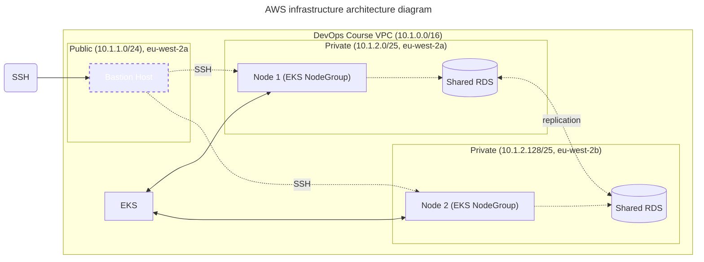

# AWS Infrastructure

## Required variables

```sh
export TF_VAR_database_username=root
export TF_VAR_database_password=password
```

## Architecture diagram


```mermaid
---
title: AWS infrastructure architecture diagram
---
flowchart LR
  subgraph vpc["DevOps Course VPC (10.1.0.0/16)"]
    subgraph subnet_public["Public (10.1.1.0/24), eu-west-2a"]
      bastion["Bastion Host"]
    end

    subgraph subnet_private_1["Private (10.1.2.0/25, eu-west-2a)"]
      eks_node1["Node 1 (EKS NodeGroup)"] -.-> rds1[(Shared RDS)]
    end

    subgraph subnet_private_2["Private (10.1.2.128/25, eu-west-2b)"]
      eks_node2["Node 2 (EKS NodeGroup)"] -.-> rds2[(Shared RDS)]
    end

    rds1 <-. replication .->  rds2

    eks[EKS]
    eks <--> eks_node1
    eks <--> eks_node2
  end

  ssh(SSH) --> bastion
  bastion .-> |SSH| eks_node1
  bastion .-> |SSH| eks_node2

  style bastion stroke-width:2px,color:#fff,stroke-dasharray: 5 5

```
