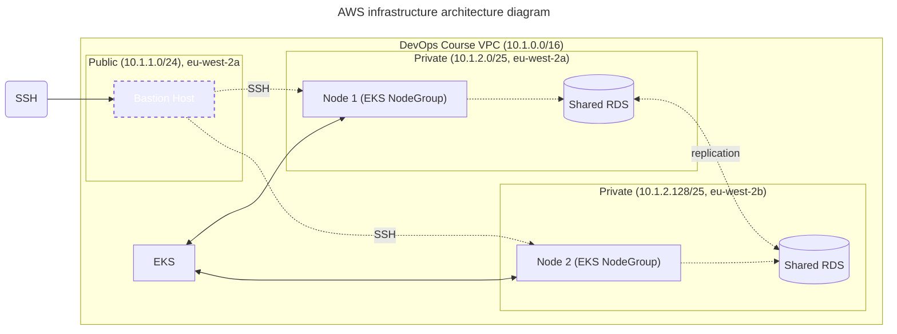

# AWS Infrastructure

## Architecture diagram



## Required environment variables
- `TF_VAR_database_username`
- `TF_VAR_database_password`


## Setup

1. Set the desired database username and password to the environment variables
   ```sh
   export TF_VAR_database_username=root
   export TF_VAR_database_password=password
   ```

2. Apply terraform
  ```sh
  terraform apply
  ```
3. After applying changes you will get hostname and port of the database in outputs

  ```sh
  Outputs:

  database_hostname = "devops-course-rds.csqt7fieauxh.eu-west-2.rds.amazonaws.com"
  database_port = 3306
  ```
4. Export them to the environment variables
  ```sh
   export DATABASE_HOSTNAME=devops-course-rds.csqt7fieauxh.eu-west-2.rds.amazonaws.com
   export DATABASE_PORT=3306
  ```
5. Continue with [Kubernetes Infrastructure](../k8s/README.md)
